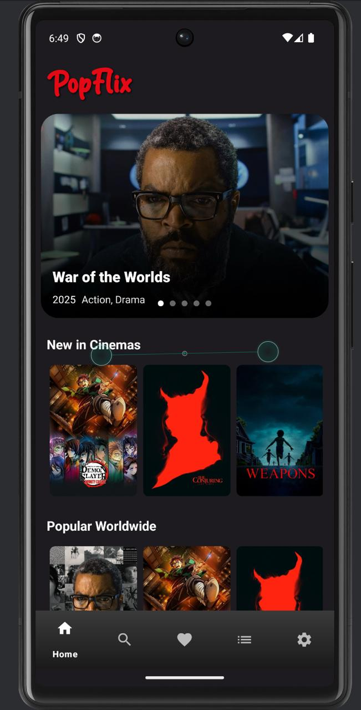
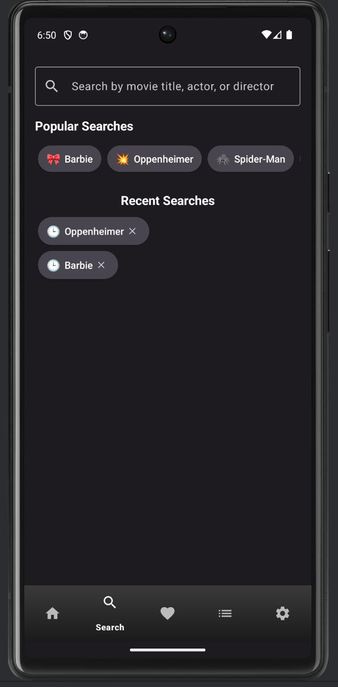
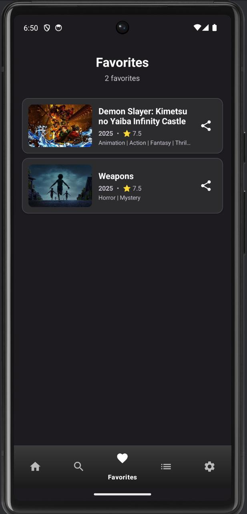
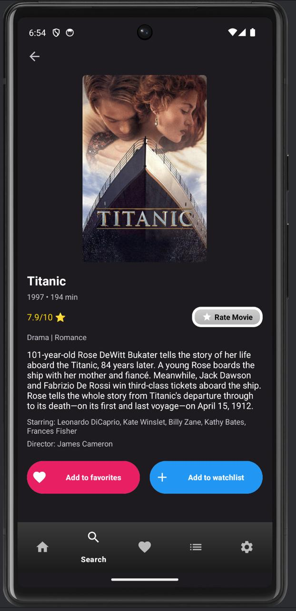
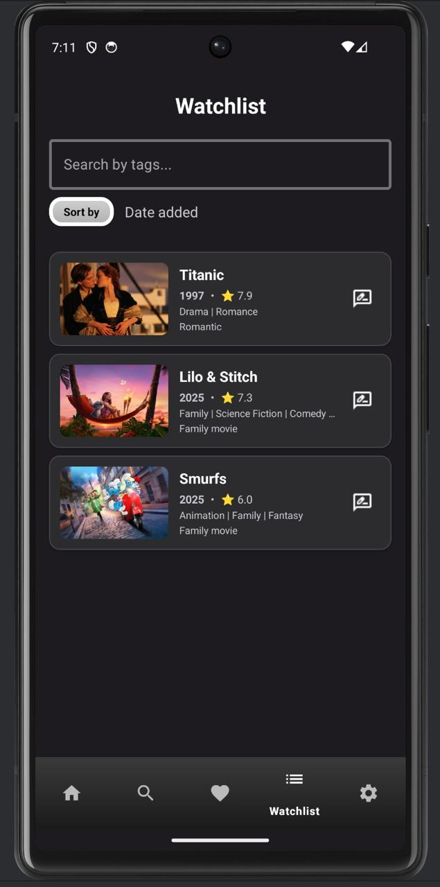
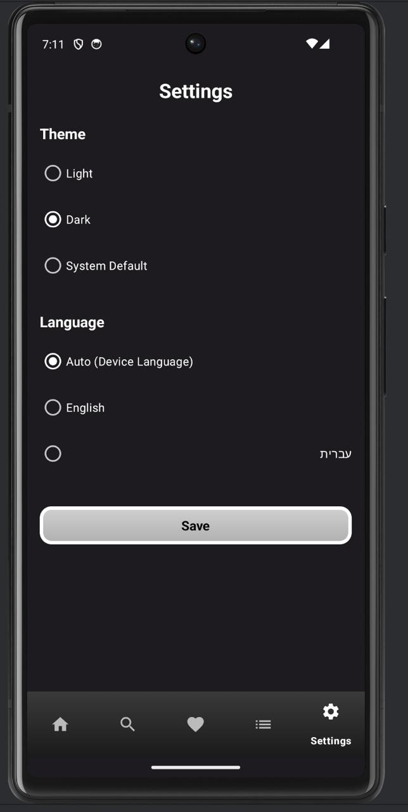

# 🎬 PopFlix

### Android Movie Discovery App

An Android application for discovering movies, browsing curated content, managing favorites and watchlists, and exploring movie details with a clean and modern user experience.

  
  
  
  
  

---

## Overview

**PopFlix** is a movie discovery Android app built with **Kotlin** and powered by the **TMDB API**.  
It allows users to explore popular and upcoming movies, search titles with history support, manage favorites and watchlists, rate movies, and enjoy a localized experience in both **English** and **Hebrew**.

The project was developed as a final Android course project and demonstrates modern Android development practices with a clean architecture and a user-friendly interface.

---

## Features

- Discover **popular**, **new**, and **upcoming** movies
- Search for movies with **search history**
- View detailed movie information
- Save movies to **Favorites**
- Manage a personal **Watchlist**
- Store data locally using **Room Database**
- Rate movies directly in the app
- Switch between **Light Mode** and **Dark Mode**
- Support **English / Hebrew** with **RTL support**
- Refresh selected content in the background using **WorkManager**

---

## Tech Stack

### Core Technologies
- **Kotlin**
- **Android SDK**
- **MVVM Architecture**
- **Repository Pattern**

### Libraries & Tools
- **Retrofit** – API communication
- **Gson** – JSON parsing
- **OkHttp** – Networking
- **Hilt** – Dependency Injection
- **Room** – Local database
- **Coroutines** – Asynchronous programming
- **Glide** – Image loading
- **Navigation Component** – Fragment navigation
- **Material Design Components** – UI styling
- **WorkManager** – Background tasks

---

## Architecture

PopFlix follows the **MVVM** architectural pattern:

- **UI Layer** – Fragments, adapters, and UI components
- **ViewModel Layer** – Handles UI logic and state management
- **Repository Layer** – Connects the UI to local and remote data sources
- **Remote Data Source** – TMDB API via Retrofit
- **Local Data Source** – Room Database for favorites, watchlist, and search history

### Data Flow
`UI → ViewModel → Repository → API / Database`

---

## App Screens

<table>
  <tr>
    <td align="center">
      <strong>Home Screen</strong>  
      
    </td>
    <td align="center">
      <strong>Search</strong>  
      
    </td>
  </tr>
  <tr>
    <td align="center">
      <strong>Favorites</strong>  
      
    </td>
    <td align="center">
      <strong>Movie Details</strong>  
      
    </td>
  </tr>
  <tr>
    <td align="center">
      <strong>Watchlist</strong>  
      
    </td>
    <td align="center">
      <strong>Settings</strong>  
      
    </td>
  </tr>
</table>

---

## Local Data Management

The app uses **Room Database** to store and manage:

- Favorite movies
- Watchlist movies
- Search history
- User preferences and related local data

This improves usability and supports a smoother experience with persistent local storage.

---

## Technical Highlights

- **Multi-language support** with dynamic language switching
- **RTL layout support** for Hebrew
- **Room persistence** for local data storage
- **Reusable adapters** and fragment-based navigation
- **WorkManager integration** for background refresh
- Clear separation of concerns using **MVVM + Repository Pattern**
- Modern Android app structure with scalable components

---

## Project Goal

The goal of PopFlix is to provide a modern, intuitive, and visually appealing platform for discovering and organizing movies on Android devices.

---

## Author

**Liron Tal**  
B.Sc. Computer Science Student  
Reichman University

---
