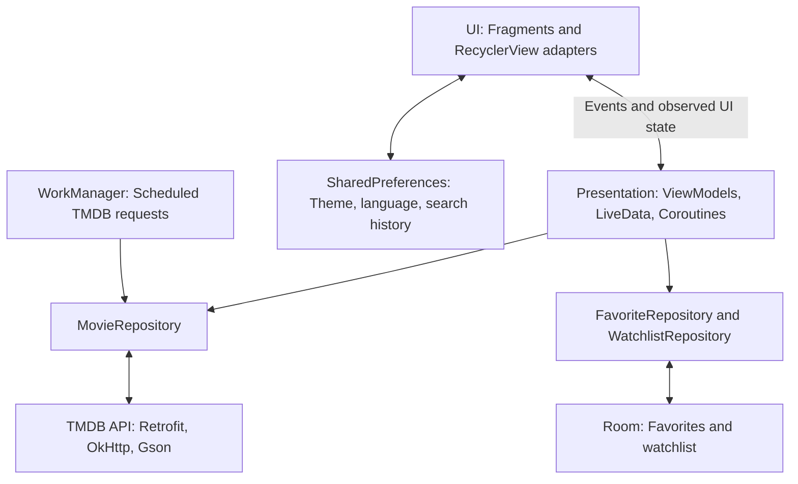

<div align="center">

# 🎬 PopFlix

### A native Android app for discovering, organizing, and rating movies

Explore TMDB movie collections, search across titles and people, and keep a personal favorites list and watchlist — all in one responsive Kotlin app.

<p>
  
  
  
  
</p>

</div>

## Overview

PopFlix is a Kotlin Android application built around the [TMDB API](https://www.themoviedb.org/). It brings movie discovery, combined search, personal lists, guest ratings, and bilingual UI support into a single mobile experience.

Developed as a final project for an Android development course, the app emphasizes a layered architecture, lifecycle-aware UI state, local persistence, and a polished browsing experience.

## Highlights

| Discover | Organize | Personalize |
| :--- | :--- | :--- |
| Browse popular, now-playing, top-rated, upcoming, and genre-based collections. | Save favorites and watchlist entries locally. | Switch between light, dark, and system themes. |
| Search by movie title or person, with debounced input and recent-search history. | Add watchlist notes, priority, watched status, and reminders. | Use English or Hebrew, including right-to-left layouts. |
| Open detailed movie pages with cast, crew, genres, and artwork. | Rate movies through a TMDB guest session. | Share favorite movie details through Android’s share sheet. |

## Architecture

The app’s primary data flow separates presentation concerns from remote and local data sources. Hilt wires the dependencies between layers.


```mermaid
flowchart TB
    UI["UI: Fragments and RecyclerView adapters"]
    VM["Presentation: ViewModels, LiveData, Coroutines"]
    MOVIE["MovieRepository"]
    SAVED["FavoriteRepository and WatchlistRepository"]
    API["TMDB API: Retrofit, OkHttp, Gson"]
    DB["Room: Favorites and watchlist"]
    PREFS["SharedPreferences: Theme, language, search history"]
    WORKER["WorkManager: Scheduled TMDB requests"]

    UI <--> |Events and observed UI state| VM
    VM --> MOVIE
    VM --> SAVED
    MOVIE <--> API
    SAVED <--> DB
    UI <--> PREFS
    WORKER --> MOVIE
```

- **Presentation:** fragments render screens; adapters render scrolling collections; ViewModels expose lifecycle-aware state through LiveData and run asynchronous work with coroutines.
- **Remote data:** MovieRepository wraps typed TMDB requests for discovery, details, credits, search, guest sessions, and ratings.
- **Local data:** Room stores favorites and watchlist entries; SharedPreferences stores application settings and recent searches.
- **Background work:** WorkManager schedules periodic TMDB requests subject to network connectivity and battery-not-low constraints.
- **Dependency injection:** Hilt supplies API, database, repository, and worker dependencies.

## Technology

| Area | Tools |
| :--- | :--- |
| Language & platform | Kotlin, Android SDK, Android 8.1+ (API 27) |
| Architecture | MVVM, Repository pattern, Hilt, LiveData, Coroutines |
| Networking | TMDB API, Retrofit, OkHttp, Gson |
| Local storage | Room, SQLite, SharedPreferences |
| UI | Fragments, RecyclerView, View Binding, Navigation Component, Material Components, Glide |
| Background work | WorkManager |

## Project structure

```text
app/src/main/
├── java/com/example/popiflix/
│   ├── PopFlixApp.kt              # Application setup, language loading, work scheduling
│   ├── data/
│   │   ├── api/                   # TMDB service definitions and Retrofit utilities
│   │   ├── database/              # Room entities, DAOs, and MovieDatabase
│   │   ├── di/                    # Hilt network and database modules
│   │   ├── models/                # API request/response and app data models
│   │   └── repositories/          # Movie, favorites, watchlist, and search-history access
│   ├── ui/
│   │   ├── home/                  # Home feed and movie carousels
│   │   ├── search/                # Debounced combined search and history
│   │   ├── detail/                # Movie details, ratings, and list actions
│   │   ├── favorites/             # Locally saved favorites
│   │   ├── watchlist/             # Watchlist, notes, status, priority, and filtering
│   │   ├── settings/              # Theme and language preferences
│   │   └── MainActivity.kt        # Navigation host and bottom navigation
│   ├── util/                      # Language and shared application utilities
│   └── workers/                   # Periodic background TMDB requests
├── res/
│   ├── layout/ and layout-land/   # Screen, dialog, and list-item layouts
│   ├── navigation/                # Navigation graph and Safe Args destinations
│   ├── values/, values-iw/        # English/Hebrew strings, themes, and styles
│   └── xml/                       # Locale configuration
└── assets/                        # Lottie animation assets
```

## Run locally

### Prerequisites

- Android Studio
- An Android device or emulator running Android 8.1 (API 27) or later
- A TMDB API key

### Setup

1. Clone the repository and open it in Android Studio.
2. Create or update `local.properties` in the project root:

   ```properties
   TMDB_API_KEY=your_tmdb_api_key
   ```

3. Sync the Gradle project and run the `app` configuration.

`local.properties` is ignored by Git. The build passes the key to `BuildConfig`, so never place the key in a tracked source file.

## App preview

<div align="center">

<table>
  <tr>
    <td align="center"><strong>Home</strong><br><br></td>
    <td align="center"><strong>Search</strong><br><br></td>
    <td align="center"><strong>Movie details</strong><br><br></td>
  </tr>
  <tr>
    <td align="center"><strong>Favorites</strong><br><br></td>
    <td align="center"><strong>Watchlist</strong><br><br></td>
    <td align="center"><strong>Settings</strong><br><br></td>
  </tr>
</table>

</div>

## Attribution

Movie data and artwork are provided by [TMDB](https://www.themoviedb.org/).

## Author

Liron Tal  
B.Sc. Computer Science, Reichman University
