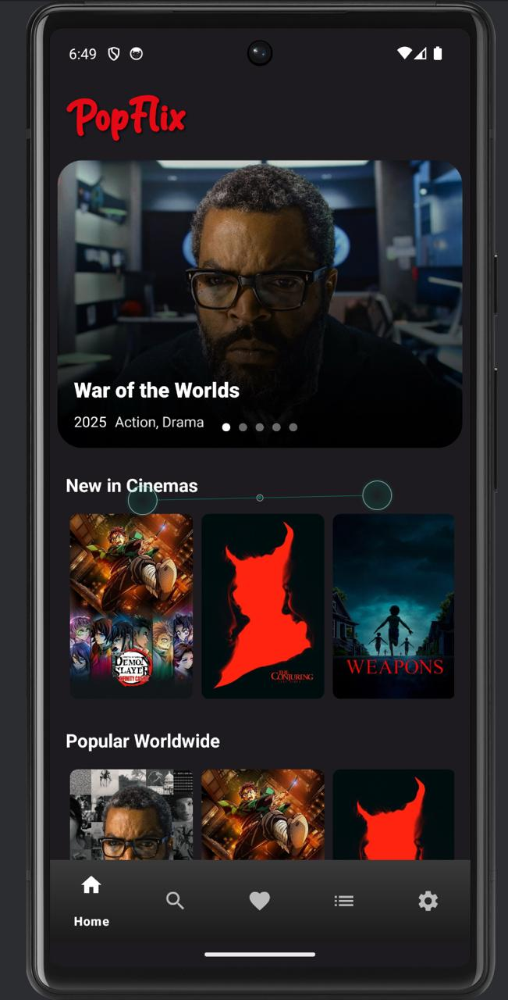
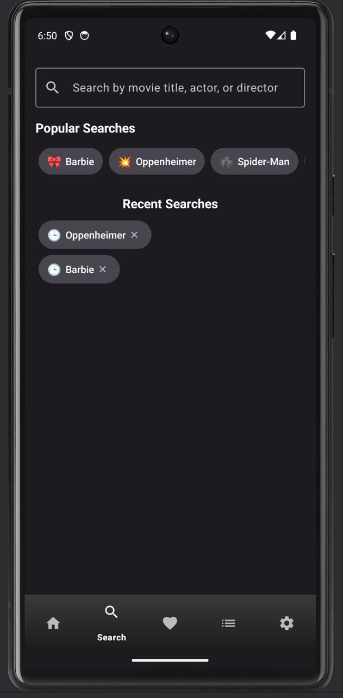
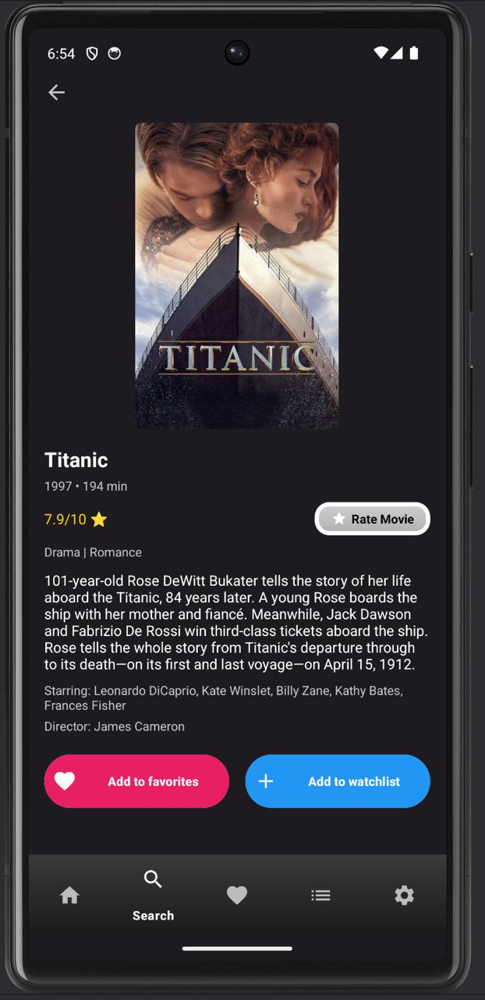
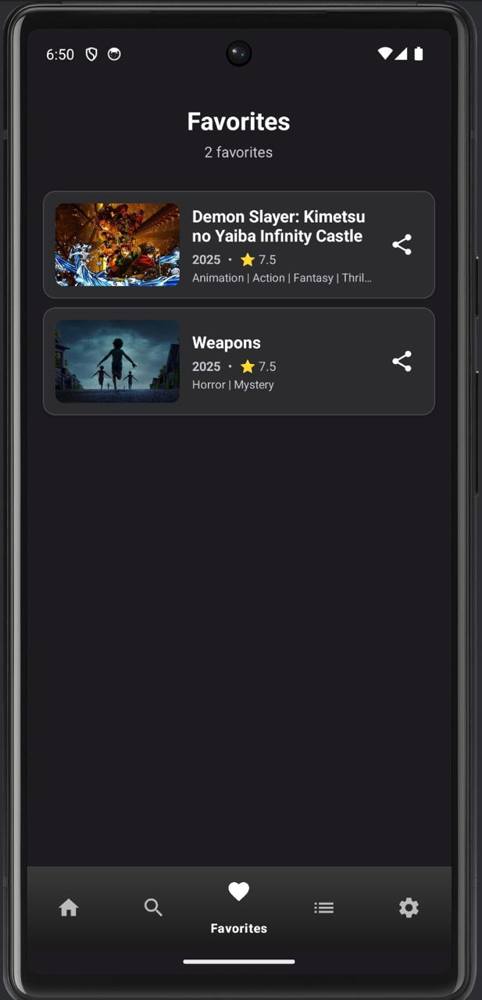
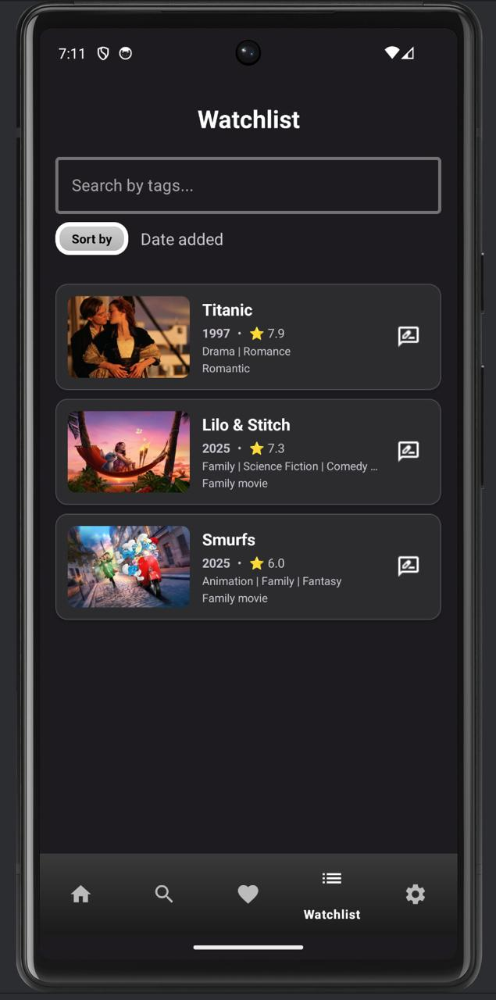
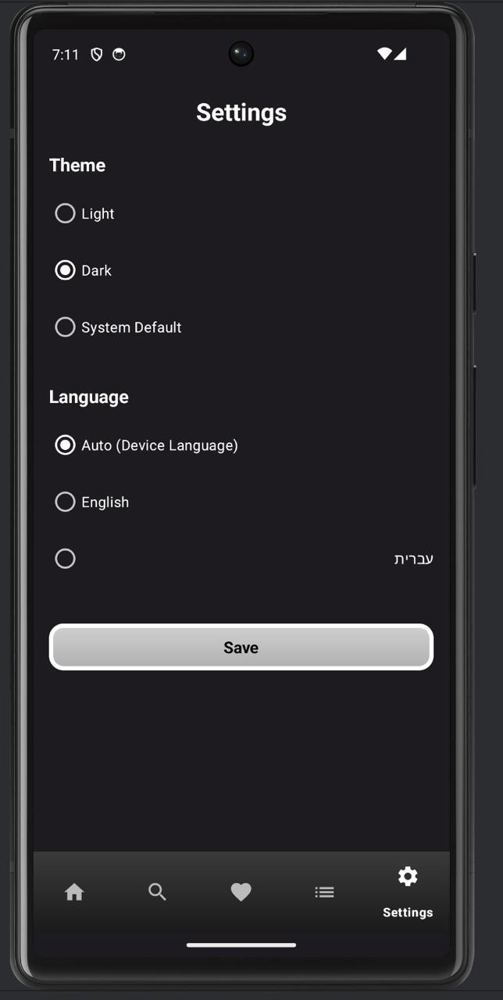
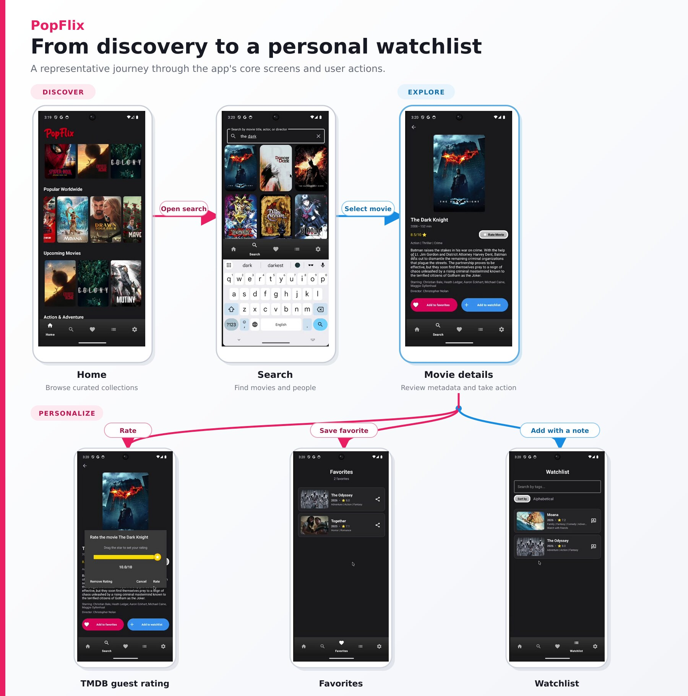
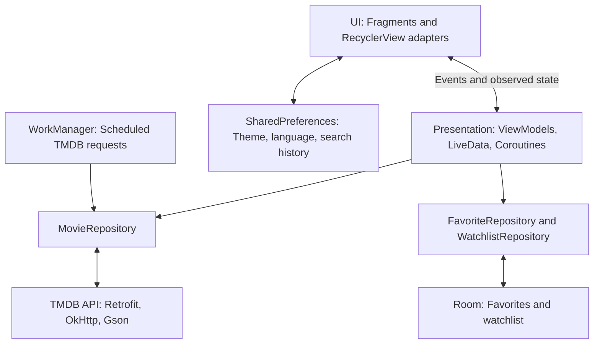

<div align="center">

# 🎬 PopFlix

### Native Android movie discovery, built with Kotlin

Discover films, search across titles and people, and organize favorites and watchlists in a bilingual, lifecycle-aware Android application.

<p>
  
  
  
  
</p>

</div>

## Overview

PopFlix is a native Android application that turns the [TMDB API](https://www.themoviedb.org/) into a personal movie-discovery experience. Users can browse curated collections, run combined searches, inspect cast and crew information, maintain local favorites and watchlists, and rate movies through TMDB guest sessions.

The application was built as a final Android development course project, with an emphasis on structured data flow, lifecycle-aware state, local persistence, dependency injection, and responsive multilingual UI.

## App preview

<div align="center">

<table>
  <tr>
    <td align="center"><strong>Home</strong><br><br></td>
    <td align="center"><strong>Search</strong><br><br></td>
    <td align="center"><strong>Movie details</strong><br><br></td>
  </tr>
  <tr>
    <td align="center"><strong>Favorites</strong><br><br></td>
    <td align="center"><strong>Watchlist</strong><br><br></td>
    <td align="center"><strong>Settings</strong><br><br></td>
  </tr>
</table>

</div>

## Product capabilities

| Discover | Organize | Personalize |
| :--- | :--- | :--- |
| Browse popular, now-playing, top-rated, upcoming, and genre-based collections. | Save favorites and watchlist entries in an on-device Room database. | Switch between light, dark, and system themes. |
| Search by title or person with 300 ms debounce, pagination, deduplication, and recent-search history. | Add and edit personal watchlist notes, search those notes, and sort the list by date added, title, release date, or rating. | Use English or Hebrew with dynamic switching and right-to-left layouts. |
| Explore movie details, artwork, genres, cast, and crew. | Rate movies through a TMDB guest session. | Share favorite movie details through the Android share sheet. |

## Core user journey

PopFlix guides users from browsing and search into detailed movie exploration, then lets them rate movies through TMDB or organize selections in favorites and a note-enabled watchlist.

<div align="center">



</div>

## Technical architecture

Most feature flows follow MVVM: fragments forward user events to ViewModels, observe LiveData, and render the resulting state. Repositories coordinate remote requests and on-device persistence, while Hilt supplies their dependencies.


```mermaid
flowchart TB
    UI["UI: Fragments and RecyclerView adapters"]
    VM["Presentation: ViewModels, LiveData, Coroutines"]
    MOVIE["MovieRepository"]
    SAVED["FavoriteRepository and WatchlistRepository"]
    API["TMDB API: Retrofit, OkHttp, Gson"]
    DB["Room: Favorites and watchlist"]
    PREFS["SharedPreferences: Theme, language, search history"]
    WORKER["WorkManager: Scheduled TMDB requests"]

    UI <-->|Events and observed state| VM
    VM --> MOVIE
    VM --> SAVED
    MOVIE <--> API
    SAVED <--> DB
    UI <--> PREFS
    WORKER --> MOVIE
```

### Engineering highlights

- **Combined search pipeline:** searches movie titles and people, expands person matches through cast and crew discovery, removes duplicate movies, and prioritizes title matches before rating and vote count.
- **Lifecycle-aware presentation:** ViewModels expose UI state through LiveData; coroutines handle network and database work without blocking the main thread.
- **Purpose-specific persistence:** Room stores structured favorites and watchlist records, while SharedPreferences stores lightweight settings and the five most recent searches.
- **Centralized networking:** Hilt provides a singleton Retrofit and OkHttp stack with Gson conversion, language-aware requests, API-key injection from BuildConfig, and debug-only HTTP logging.
- **Type-safe navigation:** Navigation Component and Safe Args connect the main destinations to a shared movie-details screen.
- **Constrained background work:** WorkManager schedules periodic TMDB fetches only when a network connection is available and the battery is not low.

## Technology

| Area | Tools |
| :--- | :--- |
| Platform | Kotlin, Android SDK, Android 8.1+ (API 27) |
| Architecture | MVVM, Repository pattern, Hilt, ViewModel, LiveData |
| Concurrency | Kotlin Coroutines, CoroutineWorker |
| Networking | TMDB API, Retrofit, OkHttp, Gson |
| Persistence | Room, SQLite, SharedPreferences |
| Interface | Fragments, RecyclerView, View Binding, Navigation Component, Safe Args, Material 3, Glide |
| Background work | WorkManager |

## Project structure

```text
app/src/main/
├── java/com/example/popiflix/
│   ├── PopFlixApp.kt
│   ├── data/
│   │   ├── api/
│   │   │   └── TmdbApi.kt                 # Typed TMDB endpoints
│   │   ├── database/
│   │   │   ├── MovieDatabase.kt           # Room database
│   │   │   ├── FavoriteMovie.kt           # Favorites entity
│   │   │   ├── FavoriteMovieDao.kt        # Favorites queries
│   │   │   ├── WatchlistMovie.kt          # Watchlist entity
│   │   │   └── WatchlistMovieDao.kt       # Watchlist queries
│   │   ├── di/
│   │   │   ├── NetworkModule.kt           # Retrofit and OkHttp providers
│   │   │   └── DatabaseModule.kt          # Room and repository providers
│   │   ├── models/                        # TMDB responses and domain models
│   │   └── repositories/
│   │       ├── MovieRepository.kt         # Discovery, search, details, ratings
│   │       ├── FavoriteRepository.kt      # Local favorites operations
│   │       ├── WatchlistRepository.kt     # Local watchlist operations
│   │       └── SearchHistoryRepository.kt # Recent-search persistence
│   ├── ui/
│   │   ├── home/                          # Hero content and movie carousels
│   │   ├── search/                        # Combined search and pagination
│   │   ├── detail/                        # Details, rating, and list actions
│   │   ├── favorites/                     # Saved favorites
│   │   ├── watchlist/                     # Notes, filtering, and sorting
│   │   ├── settings/                      # Theme and language controls
│   │   └── MainActivity.kt                # Navigation host
│   ├── util/                              # Language and shared utilities
│   └── workers/                           # Periodic background requests
└── res/
    ├── layout/ and layout-land/            # Portrait and landscape layouts
    ├── navigation/                         # Navigation graph
    ├── values/, values-night/, values-iw/  # Themes and localized resources
    └── xml/                                # Supported locale configuration
```

## Run the app

### Requirements

- Android Studio
- Android device or emulator running Android 8.1 (API 27) or later
- [TMDB API key](https://developer.themoviedb.org/docs/getting-started)

### Setup

1. Clone the repository:

   ```bash
   git clone https://github.com/LironTal01/PopFlix-App.git
   ```

2. Open the project in Android Studio.
3. Add the following entry to the project-level `local.properties` file:

   ```properties
   TMDB_API_KEY=your_tmdb_api_key
   ```

4. Sync Gradle and run the `app` configuration.

`local.properties` is excluded from version control. The build exposes the value through `BuildConfig`; API keys should never be committed to source files.

## Data source

Movie metadata, posters, and backdrops are sourced from [TMDB](https://www.themoviedb.org/). This product uses the TMDB API but is not endorsed or certified by TMDB.

## Author

**Liron Tal**  
B.Sc. in Computer Science, Reichman University
